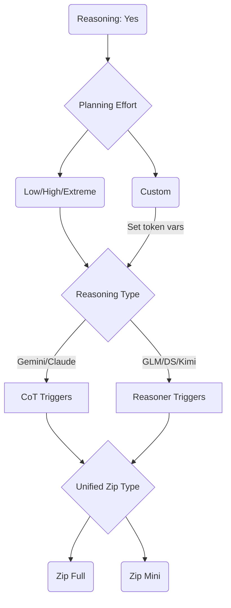

# Lando's Lengthy Loom Lecture

So you want to use **Prolix's** wonderful Lucid Loom preset? There are a lot of toggles and options and a lot of models to use them with, and it might look daunting, but it's actually pretty easy with some guidance! 

> [!WARNING]
> This is an **UNOFFICIAL** Guide to Lucid Loom by me, Landozo. **I am NOT Prolix**, the dev of Lucid Loom, I'm an end user like you! If you have feedback, feature requests, or ultra-specific questions about Lucid Loom instead of just this guide, he's the man to ask in Loom Chat! (Link [here](#where-to-go-for-help))

If you have any feedback on this guide or questions about the guide, you can find me on the Lucid Loom Thread on the AI Presets discord (Link [here](#where-to-go-for-help)).

This Loom guide is current as of 3.3 release (January 23, 2025)!

The latest release is 3.3 from https://lucid.cards/chat-presets

> [!WARNING]
> This guide is not up to date for 3.4 betas! I'll update it for 3.4 when 3.4 final is out!

> [!WARNING]
> 3.3 Final Test is a BETA release from BEFORE 3.3. Upgrade to 3.3 if you still use it! 

Best Settings for Each Model are [Here](#configuring-lucid-loom---best-settings-for-each-model).

General non-reasoning related questions about sillytavern are answered at my [SMUG Guide](https://github.com/Landozo/LumiaExpansionPacks/blob/main/Guides/LandoSMUG.md).

## Table of Contents:

- [About LLMs and Picking a model](#what-do-i-need-to-use-lucid-loom-first-pick-a-model)
	- [About LLMs](#about-llms)
	- [Frontier Models](#frontier-models)
	- [Open Weight Models](#frontier-models)
	- [Frontier Model Recommendations](#frontier-model-recommendations)
	- [Open Weight Model Recommendations](#open-weight-model-recommendations)
	- [My Third Party Provider Recommendation (NanoGPT)](#my-recommended-third-party-provider-for-open-weight-models)
- [About Sillytavern and setting it up](#what-else-do-i-need-to-use-lucid-loom-sillytavern)
- [Downloading and Importing Lucid Loom](#getting-lucid-loom)
- [Lucid Loom's Structure and Categories](#getting-the-lay-of-the-loom-the-categories)
- [Lucid Loom's Reasoning Categories](#lay-of-the-loom-reasoning-related-toggles)
	- [What is a CoT](#cots-what-are-those)
	- [Reasoning or Non-Reasoning](#reasoning-or-non-reasoning)
    - [Planning Effort Section](#planning-effort)
    - [Reasoning Trigger Section](#reasoning-triggers)
    - [CoT Selections](#cot-selections---zipbombs)
- [Configuring Lucid Loom - Reasoning related Options in Sillytavern](#configuring-lucid-loom---reasoning-related-options-in-sillytavern)
	- [Prompt post processing](#prompt-post-processing)
	- [Reasoning Formatting](#advanced-formatting---context-formatting-and-reasoning-formatting)
	- [Request Model Reasoning and Reasoning Effort](#chat-completion-reasoning-settings)
- [Configuring Lucid Loom - Non-Reasoning related Options in Sillytavern](#configuring-lucid-loom---non-reasoning-related-options-in-sillytavern)
	- [Context Size and Max Response](#non-reasoning-related-options)
	- [Streaming](#non-reasoning-related-options)
	- [Most commonly changed samplers (Temp, Top P, and Top K)](#non-reasoning-related-options)
- [Configuring Lucid Loom - Best Settings for each model (For Loom 3.3 Release)](#configuring-lucid-loom---best-settings-for-each-model)
	- [Fake Reasoning](#fake-reasoning-models-gemini-claude)
		- [Gemini 3 Pro/Flash (CoT Trigger)](#google-gemini-3-pro--flash-25-pro--flash)
		- [Claude Sonnet/Opus (CoT Trigger)](#claude-sonnet-and-opus-1)
	- [Native Reasoning](#native-reasoning-models-glm-deepseek---common-settings)
		- [GLM 4.7 (Reasoner Trigger)](#zai-glm-547)
		- [GLM 4.6 (CoT Trigger)](#zai-glm-46)
		- [Deepseek 3.2 Thinking (Reasoner Trigger)](#deepseek-32-thinking)
- [Where to Ask for Help! Loom Chat](#where-to-go-for-help)
- [Appendix](#appendix)
	- [What is Sov Hand?](#what-is-sovereign-hand-sov-hand)
	- [What is Regex?](#what-is-regex)
	- [Lumiverse Helper Extension](#lumiverse-helper-extension)
	- [Nemo Preset Extension](#nemo-preset-extension-better-organization-for-prompts)
	- [My Sillytavern Extension Recommendations](#recommended-extensions-my-personal-favorites)

## What do I need to use Lucid Loom? First, pick a Model

### About LLM's

An LLM (Large Language Model) is the AI that powers the roleplay. There are a multitude of ones to choose from and a few favorites.

As for which one to use, there are a few favorites among the people in Loom chat (the discord channel that's the home of Loom). I'll talk about the two types of models and then give you the most common recommendations.

First you have to decide if you want to host your own model or remote connect to a separate one.

Lucid Loom is highly complex and **local models small enough to be able to run on your PC tend to be UNABLE to handle it.** For example, my go-to in the olden days, a 12B (12 billion parameter, that is the size of the model and how "smart" it is) model called Mistral Nemo, can NOT handle Loom properly. If you are set on local hosting, I'd recommend 70B or higher *at the minimum*.

So nearly every member instead remote connects to a remotely hosted model.

Before I go into the types there is one last thing to mention, quantizations. Quantizations (or quants) are a way to *make models smaller and less resource hungry* by making them dumber. To use a food analogy, imagine how a lunch portion is smaller and cheaper than the equivalent dinner portion of the exact same meal at a restaurant. I can, to use a local model example from earlier, run a 12B model in a quant called K4, which makes it half the size in exchange for about a "fourth" of its smarts, a stellar tradeoff. 

*When you remote connect to models, it's useful to have an idea of the quant of the model you are connecting to (FP8 is usually the standard for third party hosting), because the same model could perform wildly different depending on the quant.* I'll elaborate on this more later, but it's a potential cause for why the same model can perform different on different providers, or why a certain model can be smart one day, and moronic the next.

Now, onto the two types of models: 

### Frontier Models

Frontier models, which are ONLY hosted by the company itself and include things you might have heard of like Claude's Sonnet and Opus, Google's Gemini, OpenAI's ChatGPT, and XAI's Grok. 

Some Pros and Cons 

The big Pro is that frontier models are the "state of the art". They receive daily stealth updates to keep them on the cutting edge, some boast parameter counts in the *trillions*, and they are connected to vast databases called RAGs (retrieval augmentated generation) to help them with looking up information. They also might have searching capabilities built right in. Plus they usually require less work out of the box to get working as they are meant for a mass audience.

Now for the Cons:
These models are hosted on the server of the company and they mass collect information on usage and actively use it to train their models. *So do not have an expectation of any privacy when direct connecting to these models.* 

Additionally, information on these models are not released, we don't know how many parameters they have, when they are updated (most of these models are tweaked daily with no changelogs or notice), and they can be dumbed down for various reasons (safety (meaning countering nsfw), other models need more compute, testing various updates) without warning.

So yeah, it's a tradeoff between performance and ease vs privacy and control.

There is another big downside, *cost*. Most frontier models cost more than the next category of model and tend to be "pay per token". Think of tokens as how much data is sent and received, 1 token is approximately 4 characters for English text. Tokens tend to be priced per million.

Now let's look at the alternative.

### Open Weight Models

Open weight models are released by the companies and let loose onto the internet as *files you can download and run on your own hardware.* These include aforementioned local models, although the larger open weight models are too resource hungry (especially ram) to run on local PC's, tending to be run by third party server providers.

These tend to have different pros and cons compared to frontier models.

Pros:
The first major pro is VERSION CONTROL because the model file is RELEASED onto the internet. Think of it like a book edition, it's released and you get the book and you have it in your hands. The book won't magically rewrite itself. Frontier models are kept by the companies that own it and are updated all the time, as if someone else is reading the book to you from far away and they can change the details without warning. GLM 4.7 (a recently released open weight model as of December 27, 2025) is GLM 4.7. It won't change, it won't be altered, and even if GLM 4.8 comes out, GLM 4.7 will still be on the internet forever. Meanwhile, a frontier like Gemini can be lobotomized one day and you won't know when or why it happened, or an older version you like can be taken offline and you have no recourse.

The second major pro is privacy. Since it can be run outside of the main company's server, you can theoretically find a hoster that will not collect your information. *You should always assume information you send out will be accessible by the hoster anyways.* But unlike companies like Google, which have huge infrastructure ready to collect and sift through data. Third party providers might host a huge variety of models, all of which collect information in different ways. They don't have the time or compute usually to sift through all that data in an efficient way. So a lot of them don't. HOWEVER, they all CAN, so to be safe, pretend they will.

The third pro is COST. A lot of open weight models are smaller and easier to run, plus they don't have massive amounts of infrastructure and RAGs tied to them. So you can find them for pay per month subscriptions instead of pay-per-token like frontier models (I'll shill my favorite later). This is much cheaper by order of magnitudes than models on Claude or Google.

Cons:
Smaller parameters and no huge RAG infrastructure means the models are less "smart" than frontier models in general. However the biggest and most advanced open weight models (Deepseek, GLM) can punch well above their weight class. To the point where I have access to both unlimited Gemini and unlimited GLM and I prefer GLM and it seems *smarter* to me for roleplay. 

Slower releases: Since the models aren't updated on the daily without warning like frontier models are, you will have to wait longer for small improvements.


## Frontier Model Recommendations

First up, frontier model recommendations. Remember the name of the game here: convenient, very fast, smart, no privacy, no control over updates, and expensive.

### Google Gemini 3 Pro and 3 Flash

Google's Gemini is the most commonly used frontier model by the regulars of Lucid Loom. There are two versions, Gemini 3 Pro, and Gemini 3 Flash. The former is estimated to be a trillion parameters, but as a frontier model, Google does not release information about it. It's pretty smart, although recently (about December 22) it got a huge hit to smarts and nobody is sure why (a day after the release of the smaller model, maybe google moved limited compute over to flash).

3 Pro can handle roleplay very well, struggles with logic sometimes, and generally has a positivity bias (It'll agree with you too much, color the story more positive, Loom can naturally mitigate this with it's many "darker" toggles). It is censored and requires a jailbreak (Loom as a preset is enough of a jailbreak).

3 Flash is Pro's smaller, lighter weight deranged little brother. It's made for general use, especially on phones, as it's Android's main AI assistant. It's got a darker color, is not as smart as 3 Pro (Although it appears to have more compute dedicated to it as of December 2025, so 3 pro isn't that much smarter), and is also censored, albeit the darker coloring lets you get away with more. Not that it matters, as Loom is enough of a jailbreak for 3 Flash as well.

Native reasoning is not used for Gemini with Loom, in favor of "fake reasoning" (I'll go into this later).

Gemini is usually used through a service called AI Studio, and like most frontier models, is "pay per token". There are free trials you can abuse and plenty of guides on the internet to do it.

There is a subscription too, but I don't know the limits of usage on it. Plenty of information out there about it.

### Claude Sonnet and Opus

Claude is considered the state of the art for roleplay and coding at the moment. Claude has two models, Opus 4.6 and Sonnet 4.6. Sonnet is smaller and equivalent to Gemini 3 Flash from earlier, Opus 4.6 is newer, larger, and comparable to 3 pro. However Sonnet is MUCH smarter than 3 flash and Opus is MUCH smarter than 3 pro.

Sonnet was originally trained up for creative pursuits, and as such is very lauded for roleplaying in particular. It struggles with logic and things like formatting. It also tends to be very token heavy, overthinking everything. You can rein it in with Claude Killer (More on that later).

Opus is larger, more complex, and oriented primarily towards coding. People say this hurts roleplaying/storytelling potential. Try using the new effort parameter (controlled by verbosity in ST when you have claude endpoint selected) to set it to medium and cause it to behave a bit more like Sonnet. However, both models are rapidly heading towards coding, so expect roleplay to continue to take hits.

The downside of both of these is that not only is Claude pay per token, it's the most expensive pay per token by far.

### Grok or GPT

Some people use Grok, I never have.

Every GPT I ever used for roleplay has been dogwater, don't use it.

## Open Weight Model Recommendations

### ZAI's GLM 5-thinking and GLM 4.7-thinking

**GLM is my model of choice**, my daily driver. ZAI has two model families, GLM (the big one, with GLM-5 being 744B parameters and 4.7 being 355B parameters) and GLM Air (little brother, 105B parameters). They release them in an alternating fashion. Currently the latest as of Feburary 2026 is GLM 5, and it's a doozy.

GLM 5 is a brand new reasoning model (we use the GLM native reasoning for Lucid Loom and hijack it with our CoT, unlike Gemini, because the native reasoning is GOOD). It is 744B parameters, a record for ZAI, and is currently so hammered in usage that it's impossible to get a good read on it. I assume it's better than 4.7 just by virtue of its size, but I'm waiting until the initial usage rush dies down to truly put it through its paces.

GLM 4.7 is a reasoning model (again, like GLM-5, we hook into native reasoning capabilities by forcing our CoT into it). It is 355B parameters, and regularly outsmarts 1 trillion parameter models like Gemini 3 Pro. It is my daily driver (I haven't gotten into GLM-5 much).

Both of these models are smart enough to handle complex formatting, html tags, keep track of stories very well. The downside is that they are slower than Gemini, because third party providers and even zai don't have as much compute as google or claude do. But it's so much cheaper as a result.

GLM 4.7 air... does not exist yet. The latest air is GLM 4.5 Air. GLM 4.6 skipped air and went straight to GLM 4.6V, a vision model (this means it can interpret pictures), which hurt the roleplay/text performance. I do not recommend using GLM 4.6V as a result.

So yeah, just use GLM 5/4.7. How can you use it though? Since it's an open weight model you have two options, from the manufacturer or third party.

The company that makes it is Z.AI and they have a subscription plan for it. You can get GLM straight from them, however, they have been doing prompt injection lately to "clean up" the nsfw of the model. If you want to use it for smut roleplay, I do NOT recommend zai, in fact, I don't recommend ZAI at all. As a source company for the model, they have the infrastructure in place to mass collect data and sort it easily.

I recommend NanoGPT, a third party provider, due to their 8 dollar a month practically unlimited subscription, I'll give more info on it later.

### Deepseek's Deepseek

Deepseek is probably the most well known of the chinese model makers. They have Deepseek 3.2 speciale and Deepseek 3.2 thinking. Both are larger 685 billion parameter models, but the former has more "active" parameters than the latter. That means Speciale is their model comparable to Gemini 3 Pro, while 3.2 Thinking is the one comparable to Flash. As far as I know the former is still only available direct from deepseek, which means you need to deal with the privacy issues inherent to using any model straight from the manufacturer. The latter is available from third party providers readily.

### Kimi K2 and Qwen

Kimi K2/2.5 Thinking is used by some people in the loomchat. It tends to be problematic and fight you, I don't recommmend it.

I don't know a single person who still uses Qwen, but people used to a lot.

## My recommended Third Party Provider for Open Weight Models

My **personal** recommendation for using open weight models is through Nano-GPT. They have an 8 dollar subscription that lets you use 60,000 message requests per month, unlimited tokens on 80+ different open weight models. They do rotate providers as the tokens are used up on their end, so sometimes you'll have a slower provider, but you can't beat 8 bucks a month for practically unlimited requests (I've never even come close to 60k chat messages per month). The subscription includes 80+ open weight third party hosted text models with things like GLM 4.7, Deepseek 3.2-Thinking, Kimi K2, Qwen, a lot of local models (including the classic TheDrummer ones like Rocinante, Cydonia, etc.), four image models (Chroma, Hidream, Juggernaut XL (animagine based), and Qwen Edit), and lots of abliterated/derestricted/finetuned versions of popular models (TheDrummer's glm 4.5 air finetune called GLM Steam comes to mind).

You can find it by googling nanoGPT, or you can help me out by using my referral link below:

https://nano-gpt.com/invite/XFjmGJg8

If you use Nano GPT with the subscription, you can access a subscription model only endpoint by entering the following as your custom (openAI-compatible) endpoint:

https://nano-gpt.com/api/subscription/v1

> [!NOTE]
> This requires you to pick Custom (OpenAI Compatible) as your api endpoint in sillytavern instead of NanoGPT, more on that later.

**This will give you only the subscription models so you run 0 risk of accidentally spending money!**

Other Providers include Openrouter (no subscription, pay as you go), Featherless, Infermatic, ArliAI, NIM, and Chutes (Don't... just don't, chutes is awful).

> [!NOTE]
> NIM is special and might require different arguments for enabling thinking, I've heard that you should add the following to your additional parameters, but do some research and find out for yourself! "chat_template_kwargs": {"thinking":True}


## What else do I need to use Lucid Loom? Sillytavern

Loom is built with one use case in mind. **Loading it in Sillytavern.**

> [!WARNING]
> Loom has a LOT of Sillytavern specific scripting and does NOT work properly in Janitor, Tavo, or any other non-Sillytavern related frontend!

Sillytavern is a roleplay focused LLM frontend. It lets you import character cards from different sources, connect to an llm either on your pc or hosted remotely, and then chat with the LLM for roleplay, while sending information about the character, the lore, your user persona, and your chat history to said LLM.

A preset determines HOW this happens and in what order. It's basically a collection of system prompts in toggles that you can switch on or off. At least Chat Completion presets are.

You might have heard about Chat Completion and Text Completion. Text completion is a much older system for talking to an LLM and it's pretty static. Chat completion is a newer model and it relies on a series of toggles to build out a huge modular system prompt!

> [!WARNING]
> Lucid Loom is a chat completion preset, so it will only be usable in chat completion mode!

Thankfully Sillytavern has a pretty robust chat completion implementation, if a bit lacking in the UI front (we can fix that with an extension which I'll show to you later in this guide)!

As for using Lucid Loom in a system other than Sillytavern, like Janitor or Kobold, Lucid Loom has Sillytavern specific scripting language and a pretty robust addon by the author himself to add custom features like more lumias and better history support, summarization, and expand the response modes in Loom itself.

**This means using it outside of Sillytavern will give mixed results at best as several core features require Sillytavern.** If you use it outside of Sillytavern and come asking for help, be ready to be told "use it in sillytavern". It is what it is.

Sillytavern has pretty robust documentation for getting it up and running.

Here are guides for installation on various operating systems including Android:

https://docs.sillytavern.app/installation/

I personally recommend running it on a desktop or laptop and then connecting to it from your phone via web browser, Sillytavern has built in support for connecting to it remotely. Sillytavern is a server, so it runs as a program and then you can visit it in the same pc's web browser, or from a remote client like a cell phone or another pc.

Information for remote connections can be found here:
https://docs.sillytavern.app/usage/remoteconnections/

It's pretty easy to connect to it from the same wifi network with some simple config file tweaks listed above in the documentation.

> [!NOTE]
> For remote connections, I use a program called Tailscale that lets you remote connect to your local network, but other IP tunneling solutions exist.

## Getting Lucid Loom

Lucid Loom can be downloaded from **Prolix's site**, Lucid Cards:

https://lucid.cards

Specifically from this page:

https://lucid.cards/chat-presets

I recommend getting the base file. The "Prolix Preferred" is the same file, but comes with his preferred roleplay toggles already turned on. His setup has all the nsfw toggles turned on, so I recommend starting with the normal base purple colored one to get a lay of the land first. There are per model customization options on his site as well, if you download it, still double check it against the guide, and if anything looks off, let Prolix know!

Once you download it, it'll be in a json format, you can import it into sillytavern via the import button. But first, you'll have to set up your sillytavern for chat completion mode and connect to your LLM!

## Connecting to your LLM

Sillytavern has a variety of api connection points you can use to connect to your model of choice. The important thing is that you choose Chat Completion in the dropdown for API, since Lucid Loom is a chat completion preset. It will not work in text completion mode.


## Importing Lucid Loom into Sillytavern

To import it, after picking Chat Completion open the left hand panel (leftmost icon on the top bar of sillytavern) and click the imnport button and select your json! This will cause the panel below to switch to Lucid Loom.


I'll go over the best options for Loom later, but first, let's scroll down in this panel 

## Getting the lay of the loom, the categories

Lucid Loom, like most presets, relies on a category system to make things less cluttered. It might seem overwhelming at first but you'll get used to it pretty quickly.

There is an extension to allow things to collapse into nice categories, I'll go over it later. First, the categories:

> [!WARNING]
> These categories are up to date for Lucid Loom 3.2 Release version. Future betas WILL have different categories!

### Prompt Variables (EDIT ME PLEASE)

This toggle allows you to edit ALL OF THE LOOM'S variables and choose how long the "Custom Response Length" toggle makes your reply, change the LLM's main output language, or change how often OOC happens (unless you use the extension, that one works better, more on that in the appendix). This must always remain toggled on, every variable in Loom is initialized (cleaned between gens) here.

It also controls the variables for other features like Claude Killer and Gem Saver (more on that later).

### Story Primers and Core Instructions

Important things like card, user persona, and scenario information are pulled in first thing in the "Story Primers" category (Loom does not use the default Sillytavern prompts for those, hence why those are still in but off later).

Then comes the core instructions for the Loom. Of note here is Aperture of Cynicism. If you use a very dark flavored LLM and want a lighter story, you can try toggling this off.


### Directives - The Loom Modes

Next up are the core operating modes (Directives) for the Loom. These changed a lot in 3.3 when Prolix implemented my directive rework and they should be a lot more straightforward now. Not only do these directives insert instructions here, they also pass on instructions (via variables) to later parts of the Loom like the reasoning and prose sections!


There are 4 options here:

- Human Controls User - This makes it so only you, the Human, can control what {{user}} does. Pick this if you intend to be the only one guiding your character.
- Sovereign Hand (Guided Weave) - This makes it so you can give stage directions for what {{user}} does and Lumia can elaborate on it on the following turn. For example, you can say {{user}} opens a door, and then in the following turn Lumia will describe the process of {{user}} opening the door. See the appendix for more details on it.
- Sovereign Hand (Lumiverse) - This is the same as the above, but lets you use the enhanced Sovereign Hand from the Lumiverse Helper Extension (More details in the appendix.)
- Weaver's Choice (Auto Weave) - This simply lets Lumia control the {{user}} whenever it's her turn and you can control {{user}} when it's your own turn. 

### Lumia Definitions and Personalities

Then Lumia definitions (physical description) and personalities. Loom's main claim to fame is that it causes the AI to assume the role of a storyteller called Lumia. There are dozens of Lumias with different personalities available through an extension I'll talk about later by the same dev of Loom. For now, you get 7 personalities built in with a custom option at the end to allow pulling in extra lumias from the extension.


One thing to keep in mind under personalities is "Weave Lock". This helps mitigate the personality from affecting the story too much.


### Various Story and Response related Categories

Then the rest of the toggles are all things that affect the generated story, like the point of view of the storyteller, genres, narrative styles, plot progression options, response length options, text formatting, prose guidelines, dialogue options, nsfw options, and story details.


### Utilities and Trackers

Utilities and Trackers are two categories that have little useful utilities like OOC commentary, time lookups, summarization utilities, and the like. Trackers are various little trackers that help Lumia keep track of what has happened thus far in the story (This is also where compatibility with Prolix's extension, Silly Sim Tracker, is turned on).


### Story Details

After that is Story Details, where the only important things are World History (Lorebooks) and the optional Lumiverse extension summarization toggle (I'll go over this later) which is off by default. 

> [!NOTE]
> The reason this section is full of turned off toggles is because Loom does not use them. But if you delete them, Sillytavern breaks, so we leave them here and off.**


Keep these off except for World Info (Before and After). Lumiverse summary can be turned on if you use the extension.

### Chat History

This is where Chat History lives, it's the best place for it from experimentation in the past.

## Lay of the Loom: Reasoning Related-Toggles

Next up are the Reasoning related toggles. But first, some reasoning terminology:

### CoTs? What are those?

CoTs, or Chain of Thoughts, are a kind of checklist to guide the reasoning process of an llm. Lots of chat completion presets use them. There are two different ones in Loom. And we control them with various toggles dynamically.

> [!WARNING]
> **ONLY USE ONE COT AT A TIME (Zipbomb Full or Zipbomb Mini). THIS IS IMPORTANT.**

### Reasoning or non-Reasoning?

Lucid Loom is built with reasoning in mind. It works a lot better if you are using the reasoning capabilities of an LLM. If you don't want to use Reasoning, I'll have a section at the end for you.

So what do we mean by reasoning. Well reasoning is using the first part of the response of an llm to "think through" or plan the response, and then it follows it with the final actual response.

> [!WARNING]
> In Sillytavern, the reasoning block should be contained in a dedicated dropdown box (see picture below). **If it isn't, your reasoning settings are wrong.**


I will be going over how to set up reasoning settings later in the guide.

The important thing is that this reasoning block is NOT sent as part of chat history. So all the planning will not clutter up your context!

### Fake vs Native Reasoning

So what does this actually mean?

Below, you'll see the two kinds of reasoning. You can see that in native reasoning/chinese models, we want to use the native reasoning block of the model, so we use Loom's CoT to hijack it.

Meanwhile for Western or fake reasoning models, we hide the model's reasoning block in ST using a checkbox and then stuff the CoT into the main post-reasoning reply.


So how do we control this?

You'll see that the Loom CoT sections are split up into 3 sections.

### Planning Effort

This helps tell your LLM how much work to put into the reasoning phase by dynamically injecting values into the CoT. I recommend keeping it on extreme by default.


You might notice that certain models may speedrun the CoT (not enough detail, Gemini loves to do this), or overinflate the CoT (Sonnet is very guilty of this). For this I came up with custom planning effort toggles that Prolix was kind enough to add in.

They are in the section in the form of "Gemini Saver" and "Claude Killer". The former has a minimum word count per step by default, the latter has a maximum word count per step. They are interchangeable (you can edit maximum to minimum at will) and you can mix and match settings by editing the variables in the toggle. Below you can see what the variables look like, you can freely edit the word counts and change minimum to maximum or vice versa at will.


> [!WARNING]
> Remember to only enable one planning effort at a time!

### Reasoning Triggers

This little section has the option to switch between Fake Reasoning and Native Reasoning.


For fake reasoning models like Gemini or Claude, you'll pick the 'CoT Triggers (Gem/Claude)' toggle. This will forward `<think>` tags into the beginning and end of the CoT. These are useful for "fake reasoning" models like Gemini where you have to start the reply with a `<think>`.

For native reasoning models like GLM or deepseek, you'll pick the 'Reasoner Trigger (GLM/DS/Kimi)' toggle. This is for models smart enough to handle the thinking block start and stop on their own, like GLM 4.7.

> [!WARNING]
> Remember to only enable one trigger type at a time!

### Cot Selections - Zipbombs!

For your CoT selection you have two Zipbombs. These are large, detailed multi-step checklists where Lumia thinks through her reasoning in character to plan the story.

You'll find two Zipbombs, full and mini. They are similar but full has more detailed and longer language, while mini is smaller and sleeker. I personally recommend mini as a default, it's gotten more development lately.


> [!WARNING]
> Remember to only enable one CoT at a time!

To summarize, here's a chart of how to pick your CoT options.



### That's a lot of Information

Yes it is, thankfully you don't have to remember most of it. It's mostly here for you to refer back to if you have any questions.

Now that you have a better idea of what Loom looks like. Let's get to installing it!

## Configuring Lucid Loom - Reasoning Related Options in Sillytavern

Okay, now that you've imported Loom and we've gone over the structure, we can configure it for proper reasoning! First we'll start with Sillytavern options.

Thankfully there are only a few places we'll have to look to get reasoning up and running. I'll point out the locations and what they do first, and then we'll tackle how to set them up for each model afterwards. There are only three locations to set, prompt post processing, reasoning formatting, and chat completion settings. After that you just pick the right zipbomb, set your samplers to your flavor, and you are good to go!

### Prompt Post Processing

In the API Tab underneath where you select the model is a dropdown called Prompt Post Processing. This alters the raw prompt sent out to the LLM to better help it understand which things are from the system and which are from the user.


There are several options:
- None (no processing applied) 
- Merge Consecutive (Merge consecutive messages from the same role)
- Semi-Strict (Merges Roles and Allow one optional system message)
- Strict (Merge roles and Allow one optional system message and sends a user message first)
- Single User Message (Merges all messages from all roles into a single user message)

Additionally there is tools or no tools for each of these. Tool calling lets llms interact with external systems like programming apis, web searches, etc. These have to be set up on the LLM's side and you'll probably already know if you have them on. I'd recommend picking no tools by default if you don't know what this means.

### Advanced Formatting - Context Formatting and Reasoning Formatting

In the advanced formatting tab (The A up top to the right of the API icon), you'll find that most of it is grayed out since most of these options are for text completion. However we still have a few important sections here.


To the lower left are three checkboxes under the context formatting section. These are user preference except for Trim Incomplete Sentences, you'll want this one UNCHECKED, or it can break loom tags and formatting.


On the lower right is the Reasoning formatting section.

First are three checkmarks:

Auto-Parse should ALWAYS be on, it enables the below section to be able to capture text into a reasoning box if the tags are correct. This is the only way "fake reasoning", which is what we use for Gemini, Claude, and GPT, can work.

Auto-Expand expands the little thinking box containing the reasoning upon each new message, this is user preference.

Show Hidden shows the reasoning time for models with hidden reasoning, I recommend you leave this on.

Below that is a **Reasoning Formatting** dropdown you can expand. This is where you set the reasoning formats.


I recommend for pretty much everyone that you pick Deepseek here. Gemini uses it, Claude uses it, GLM uses it, and of course Deepseek uses it. Both fake and native reasoning models will use deepseek formatting, and if they don't, there's no harm in leaving this on deepseek anyways.

The dropdown sets the next two boxes, Prefix and Suffix, which are what will open and close the reasoning block.

Prefix for deepseek format will usually be \<think\> followed by an empty newline. If the newline is missing you can add it in by hitting "enter" after the \<think\>.

Suffix for deepseek format will usually be \</think\> preceded by an empty newline. If the newline is missing you can add it in by hitting enter BEFORE the \</think\>.

Separator is usually always empty.

Below that in miscellaneous is one box that we care about, **Start Reply With**


Start Reply With is ALWAYS empty for native reasoning models like GLM and Deepseek, and usually filled with the same thing you have in the prefix for fake reasoning models like Gemini and Claude.

> [!WARNING]
> This is important! If your reasoning doesn't work, Start Reply With is the first place you should check.

> [!NOTE] 
> These reasoning models save with your API settings, so hit SAVE on the api page after editing them (yes, they save with the api profile, not with the preset settings).


### Chat Completion Reasoning Settings

In the left hand Chat Completion menu above where the loom toggles are and below the sampler sliders is a little dropdown called Chat Completion Settings.

In there is a toggle option call "Squash System Messages". This can be used for some prompt post processing options like None, but unless directed to, I'd recommend you leave this UNCHECKED.

The important section is below that. Two options both related to Reasoning.

Request Model Reasoning affects the ability of Sillytavern to show incoming native/non-fake reasoning at all. If you are using native reasoning, this checkbox MUST BE ON (you'll still receive reasoning without it on, but sillytavern will not show it, meaning you just wasted tokens for no reason).


Next is Reasoning Effort, you want this on Auto generally. The reasoning models we use (GLM/Deepseek) don't support reasoning effort, and the fake reasoning models we use (Gem/Claude) we don't want their reasoning at all!


So it's ON / Auto for GLM and Deepseek, OFF / Auto for Gemini and Claude!

To save these you hit the save button by the preset dropdown up top:


## Configuring Lucid Loom - Non-Reasoning Related Options in Sillytavern

Next there are some universally useful options for every model.

Context Size is how big the context is. Every model has a different value (GLM is 200k, Gemini is 1 million). Sometimes setting it to 2/3's the max context provides better results (I follow this rule as a law).

Max Response Length is how big the response you can get back is. I suggest 16384 or 32768.

Streaming On or Off. Streaming off means you won't get any reply until the entire reply is posted. Loom works perfectly with it on, so turn it on so you can see the thinking in realtime!

Samplers are the sliders that determine how creative or non-creative a model is. There are typically three samplers we play around with:

Temperature. Temperature determines how "whacky" the output of the model is. Higher temp = more whacky. Lower temp = less creative. Every model has a happy medium.

Top K. Top K determines how many of the most likely option is taken. Let's say I meet someone and I want to say hi. When I open my mouth, the most common thing I might say is Hello, followed by Hi, or Heyo, or what's up, for example. Top K's value takes those most common values and cuts them off. So a Top K of 40 means only the 40 most likely values are kept and the rest are discarded.

Top P. Top P is a way to make the least likely value more likely. It works like a curve in test grading. Everyone gets the benefit of the curve, and it hurts the top/most likely response the most while benefitting the lowest one the most.

These are the main three samplers people play around it, the rest are to user's taste more often. Top K might be missing from your options, you can send it with additional parameters or the custom sliders extension if so (not that important).

To save these you also hit the preset save button up top.


So which setting is the recommended for each model?

## Configuring Lucid Loom - Best Settings for each model 

These best settings are current as of Lucid Loom 3.3 (January 23, 2025).

> [!NOTE]
> The following is collected from the common regulars of the Lucid Loom discord chat.

The way the below works is that you first set the common settings for your reasoning type and then move to your actual model's settings. So for Gemini for example, you'd follow the Fake Reasoning settings, and then go to the Gemini section and continue with those settings!

## Fake Reasoning Models (Gemini, Claude)

For all fake reasoning models like Gemini 3 Pro/Flash and Claude Sonnet/Opus we want the following settings in common:

Reasoning Formatting (Advanced Formatting Tab, lower left):

Deepseek in the dropdown. \<think\> (followed by a newline) Prefix and \</think\> (preceded by a newline) suffix.

Start Reply With: Different per model (see below)!


Hit save on your api profile after this since it's saved there.

Chat Completions Reasoning Section:

Request Model Reasoning should be OFF/Unchecked, **always**! We do not use native reasoning for Gemini or Claude!

Model Reasoning Effort is set to auto, **always**! This means it won't send an effort!

Hit save on the preset panel after setting the above.

### Google Gemini 3 Pro / Flash, 2.5 Pro / Flash

Prompt Post Processing: Semi-strict or Merge

Hit save on the api profile to save the above after setting it.

Reasoning Trigger in Loom: CoT Triggers (Gem/Claude).


Reasoning Effort: Auto (We do not use Gemini's native reasoning)

Context and Samplers:
- Context Size 600k-1000k
- Response Size: 32762
- Streaming ON
- Temperature: 1
- Top K: 255
- Top P: .96

Hit save in the profile preset after setting these.

### Claude Sonnet and Opus

Prompt Post Processing: Semi-strict (Merge Fallback)

Start Reply with:

- \<think\> for Sonnet
- No/empty SRW for Opus (If this doesn't work, add a think, but sometimes a simple . in it can be enough).

> [!NOTE]
> Claude Sonnet and Opus can break with newlines or empty/whitespaces after \<think\> sometimes! So try without it if you have problems/refusals! Also with Opus, \<think\> might not even be necessary!

Hit save on the api profile to save the above after setting it.

Reasoning Trigger in Loom: CoT Triggers (Gem/Claude).


Reasoning Effort: Auto (We do not use Claude's native reasoning, and this value sets budget tokens which is soon to be deprecated!)
Verbosity: Auto/Medium (For Opus 4.6+ and Sonnet 4.6+ only)

> [!NOTE]
> If and only if you have the CLAUDE Endpoint selected in Sillytavern, the verbosity dropdown will send the new effort parameter added recently to Claude models (4.6+). High is the default (auto sends none, so it'll be high). Max is only usable on Opus 4.6. I recommend default or medium to save on tokens. Read more about it [here](https://platform.claude.com/docs/en/build-with-claude/adaptive-thinking#adaptive-thinking-with-the-effort-parameter).

Context and Samplers:
- Context Size 120k-200k
- Response Size: 32762
- Streaming ON
- Temperature: 1
- Top K: 0
- Top P: 1

Hit save in the profile preset after setting these.

> [!WARNING]
> Lucid Loom is NOT Claude cache friendly, lots of things change from gen to gen. Prolix's recommendations are to try to shut off Chaos Modifier and SillySim Tracker in Utilities/Trackers.

> [!WARNING]
> Claude Models like to prattle on and on and re-draft in step 12. If you get this add the below line to your step 12 in your chosen CoT:

```*No Draft Reworks* I will not write out drafts here. Check for a step 13 for drafts, if not there, skip the drafting process.```

## Native Reasoning Models (GLM, Deepseek) - COMMON SETTINGS

For all native reasoning models like GLM and Deepseek we want the following settings in common:

Reasoning Formatting (Advanced Formatting Tab, lower left):

Deepseek in the dropdown. \<think\> (followed by a newline) Prefix and \</think\> (preceded by a newline) suffix.

Start Reply With: *EMPTY, ALWAYS EMPTY FOR EVERY NATIVE/CHINESE REASONING MODEL*


Hit save on your api profile after this since it's saved there.

Chat Completions Reasoning Section:

Request Model Reasoning should be ON/Checked *(This is essential for all reasoner models)*!

Model Reasoning Effort is set to Auto, **always**!


Hit save on the preset panel after setting the above.

### ZAI GLM 5/4.7

Prompt Post Processing: Semi-Strict (Use Single User as a Fallback)

Hit save on the api profile to save the above after setting it.

Global Think Trigger: OFF (The one at the start of the preset)

Reasoning Trigger in Loom: Reasoner Triggers (GLM/DS/Kimi).


Reasoning Effort: Auto (GLM does not support Reasoning Effort according to the Z.AI API Docs)

Context and Samplers:
- Context Size 128k-200k
- Response Size: 16384
- Streaming ON
- Temperature: .85-1
- Top K: 40 (Optional, Additional Parameters or Custom Slider to add it on openai custom)
- Top P: .93 (Default is .95)

Hit save in the profile preset after setting these.

If these don't work you can use the below settings as a fallback.

> [!NOTE]
> Once again, for NanoGPT users, remember to pick the GLM-5/4.7:thinking model, not the plain one without thinking.

> [!NOTE]
> If you can't get proper adherence, switch the Reasoning Trigger in Loom to CoT Triggers as a fallback.

> [!WARNING]
> GLM 5 likes to prattle on and on and draft in step 12, a Claude-like behavior. If you get this add the below line to your step 12 in your chosen CoT:

```*No Draft Reworks* I will not write out drafts here. Check for a step 13 for drafts, if not there, skip the drafting process.```

### ZAI GLM 4.6

Unlike GLM 4.7, GLM 4.6 isn't mostly smart enough to know when to close its own reasoning, so we use a different setup.

Prompt Post Processing: Single User

Hit save on the api profile to save the above after setting it.

Global Think Trigger: ON (The one at the very start of the preset)

Reasoning Trigger in Loom: CoT Triggers (Gem/Claude). (4.6 has trouble with injecting reasoning compared to 4.7)


Reasoning Effort: Auto (GLM does not support Reasoning Effort according to the Z.AI API Docs)

Context and Samplers:
- Context Size 128-200k
- Response Size: 16384
- Streaming ON
- Temperature: .85-1
- Top K: 40 (Optional, Additional Parameters or Custom Slider to add it)
- Top P: .93 (Default is .95)

Hit save in the profile preset after setting these.

> [!NOTE]
> Once again, for NanoGPT users, remember to pick the GLM4.7:thinking model, not the plain one without thinking.


### Deepseek 3.2 Thinking

Prompt Post Processing: Semi-Strict or Merge

Hit save on the api profile to save the above after setting it.

Global Think Trigger: OFF (The one at the start of the preset)

Reasoning Trigger in Loom: Reasoner Triggers (GLM/DS/Kimi). (You can try CoT Triggers as a fallback if it's not catching reasoning properly.)


Reasoning Effort: Auto (Deepseek does not support Reasoning Effort according to the Deepseek API Docs)

Context and Samplers:
- Context Size 128k
- Response Size: 16384
- Streaming ON
- Temperature: 1-1.5 (Deepseek Recommends 1.5 on the Deepseek API, Everywhere else, for DS 3.2, use 1.0)
- Top K: 0 (Might not support it)
- Top P: .95

Hit save in the profile preset after setting these.

> [!NOTE]
> As of January 23, 2026, Deepseek-Reasoner IS 3.2 Thinking.

### Settings for not using reasoning at all

> [!WARNING]
> Lucid Loom is designed for using Reasoning/CoT, to the point where without the CoT, some instructions are not even injected at all. If you are not using a CoT, and something isn't working, that is probably why!

For people who don't want to use reasoning, be aware that Loom has no reminder handrails for non-reasoning use (I'll be coming up with some soon and reccing them to Prolix). 

The below are settings for **how I use** non-reasoning when I randomly do:

Reasoner Formatting Settings:

Doesn't matter, but you need to make sure START REPLY WITH is EMPTY.

Prompt-Post Processing: Refer back to your model's settings up top.

Hit save to lock these in.

Chat Completion Settings:

**Request Model Reasoning should be UNCHECKED.**
Model Reasoning Effort should be set to Auto.


Global Think Trigger at the top of Loom: **TOGGLED OFF**

CoT Selection: 
**Ensure no CoT is selected at all**, so ensure that neither Zipbomb Full nor Zipbomb Mini are checked.

You should be good to go with no reasoning now.

> [!NOTE]
> For NanoGPT GLM users, pick the model without `:thinking` at the end if you don't want to use reasoning.

> [!Warning]
> Again, remember, Lucid Loom does not work well without reasoning/CoT on!

# Where to Go for Help!

In the AI Presets discord:

https://discord.gg/y6JPs948

There is a Lucid Loom Thread in said discord:

https://discordapp.com/channels/1357259252116488244/1414663352428396574

Prolix, the creator of Lucid Loom, hangs out in here. I also hang out in there, as well as other helpful regulars. Feel free to ask in the channel for help!

---

# Appendix

## What is Sovereign Hand (Sov Hand)?

Sovereign Hand is a feature pioneered by Easy and endlessly iterated on by Prolix. What it does is take your input on what {{user}} is doing in the message you send, and then in the next AI sent reply, it will rewrite and expand upon what you wrote into full prose with additional detail.

So for example if you wrote {{user}} opened the door. It will write about {{user}} seeing the door, walking up to it, feeling the doorknob, opening it, etc.

This means it echoes (repeats) the last response, meaning you need to TURN OFF ANTI-ECHO DIALOGUE SEAL in the Core Instructions section (it's there in 3.2, in prose in older ones).

It also means Lumia controls User, which means you need to TURN OFF HUMAN CONTROLS USER toggle in the same section.

## What is Regex?

Regex is short for Regular Expression, it's a scripting language that allows you to find text and either replace it or get rid of it. The most common use of it is ST is to trim out old tags. Loom has some custom regexes you can turn on if you want, but I would not recommend using them, instead I recommend using:

## Lumiverse Helper Extension

This is an extension by Prolix, the same dev of Lucid Loom that can be found here:

https://github.com/prolix-oc/SillyTavern-LumiverseHelper

Features:

- Import custom Lumias straight from the extension (I've pushed 40 Lumias there as of December 2025, and Prolix and Jun have pushed a ton too!)
- Import custom narrative styles (I've pushed nearly 20 allowing Lumia to write from famous authors throughout history)
- Import custom utilities (I'm about to push a pack!)
- Better Sovereign Hand (Sov Hand that allows inserting the user message, trimming old context, and lots of other stuff)
- Chat History Cleaning Features (Trim old Loom specific tags or any html from old replies, replacing the need for Regex)
- Summarization (A summarization engine that supports alternate LLMs other than your main)

> [!NOTE]
> You download/import the custom lumias and narrative styles from the pack browser in the extension itself, not from Prolix's site!

To use Lumiverse features you have to enable the proper feature in Lumiverse first and then pick the right toggles in Lucid Loom: 

- To use Lumiverse Summarization, turn on the Summarization toggle in the Story Details part of Lucid Loom
- To use Custom Lumias, you have to ensure both the Lumia Definitions and Lumia Modifiers section have their (Custom) or (Lumiverse) toggles on (near the bottom of said section).
- To use Lumiverse Sov Hand, first ensure it's on in the extension, then pick the Sovereign Hand (Lumiverse) toggle in core directives!
- For custom Utilities, Narrative Styles, and Human Retrofits, ensure the proper custom/lumiverse toggle is on in the respective Lucid Loom section!

## Slider Macros

An extension by Prolix and I that allow you to control macro outputs and variables with sliders in the chat or text completions panel, similar to the custom sliders that let you control samplers.

https://github.com/Landozo/Extension-SliderMacros

## Nemo Preset Extension (Better organization for Prompts)

This extension by Nemo allows you to have the categories nest in dropdowns in the prompt manager, saving your scroll finger and your sanity. Link here:

https://github.com/NemoVonNirgend/NemoPresetExt

It also has a bunch of other ui overhauls and features.

Some important changes to make, Turn off "Unified Reasoning Section", it can occasionally break reasoning settings. Also I recommend changing Section Dropdown Style to Accordion List for your own sanity.

## Recommended Extensions (My Personal Favorites)

Essentials for Loom:
- Lumiverse Helper (Custom Loom Features)

https://github.com/prolix-oc/SillyTavern-LumiverseHelper
- Nemo Preset Extension (Make Loom Categories easier to navigate)

https://github.com/NemoVonNirgend/NemoPresetExt

SELF SHILLING:
- Slider Macros (Control macros and variable outputs with custom sliders, like how samplers are controlled)

https://github.com/Landozo/Extension-SliderMacros
THE GOATS:
- Guided Generations (Lets you send next reply guidance to the LLM without having to send a reply)

https://github.com/Samueras/GuidedGenerations-Extension
- Moonlit Echoes Theme (Theme so ubiquitous, nearly everyone uses it, be sure to use glimmer)

https://github.com/RivelleDays/SillyTavern-MoonlitEchoesTheme
- Presence (allows you to set groupchat members to only see the scenes where they are present)

https://github.com/lackyas/SillyTavern-Presence

UI Improvements:
- Custom Sliders (Add in missing sliders, like top k into openai)

https://github.com/SillyTavern/Extension-CustomSliders

To make your chats better
- Silly Sim Tracker (Also by Prolix, the maker of Loom, a fancy tracker that can track stats, relationships, and loads of other stuff, works well with Loom!)

https://github.com/prolix-oc/SillyTavern-SimTracker
- Group SendAs (Send a message as a group member in a chat with an easy button)

https://github.com/SillyTavern/SillyTavern-GroupSendAs
- Timelines (Visual Novel Timeline based navigation for Branching Chat Histories)

https://github.com/SillyTavern/SillyTavern-Timelines

Better Memories:
- Memory Books (Allows saving entire segments of multiple messages to lorebooks for cross chat recall)

https://github.com/aikohanasaki/SillyTavern-MemoryBooks
- World Info Recommender (Guided event creation from messages for lorebooks)

https://github.com/bmen25124/SillyTavern-WorldInfo-Recommender

Better Characterization:

- BunnyMo (Lorebooks that allow smart insertion of character traits)

https://github.com/Coneja-Chibi/BunnyMo
- Carrotkernel (Automates the above)

https://github.com/Coneja-Chibi/CarrotKernel

Vectorization (A way to save context on messages, lorebooks, etc.):
- Vecthare (Alternate Vectorization Storage Engine)

https://github.com/Coneja-Chibi/VectHare
- BananaBread (A vectorization/embedding server, you'd use the above to connect to it)

https://github.com/prolix-oc/BananaBread


