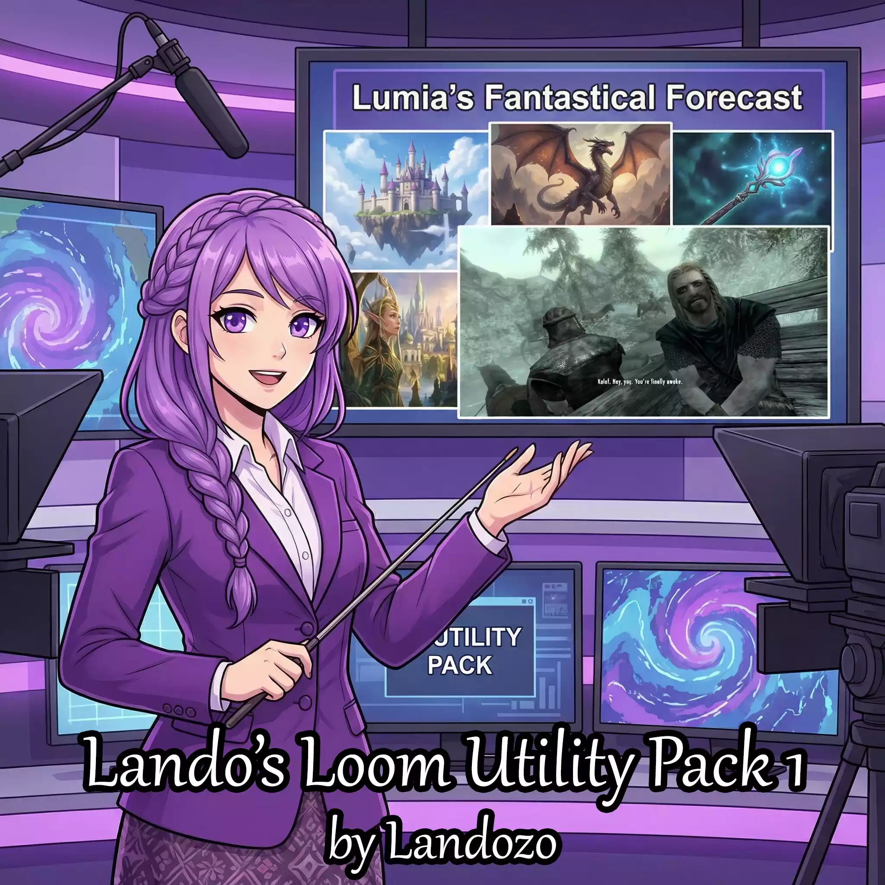

# Lando's Loom Utility Pack 1




This is a listing of every toggle in my Loom Utility Pack 1 so you can see it in full.

Some of these might not work if your model is too dumb!

> [!NOTE]
> Remember to turn on the custom/lumiverse trigger underneath the Utilities section of Lucid Loom to be able to use these after picking them in Lumiverse!


# Actual Listings

## Image to NPC Transmutation

This lets you use a vision model or image captioning to generate an npc!

Toss Lumia the following and the image description!:

OOC: Generate me an NPC from the following image

Then follow her instructions!

````
### **Loom Utility: Image-to-NPC Transmutation**

{{// This is meant to be used with either a vision enabled model or image captioning. }}{{trim}}

Upon explicit Human OOC invocation, I immediately suspend the active weave and convert an image description into a story-ready NPC. No in-character narration is produced until this utility completes.

---

#### **Trigger**

* Human issues:
  `OOC: Generate me an NPC from the following image`

It is important that I stop the story and follow this instruction!

---

#### **Input**

```
[Image description or image-derived caption]
```

---

#### **NPC Output Structure**

1. **Core Traits**
   Physical form, species, and notable visual features grounded in the description.

2. **Attire & Gear**
   Clothing, equipment, and condition with practical or stylistic implications.

3. **Personality & Vibe**
   Temperament inferred from visual cues only; no unsupported speculation.

4. **Narrative Hook**
   A flexible backstory or role suitable for immediate use.

5. **Story-Relevant Hook**
   A version adapted to the current world, canon, and active threads.

---

#### **Rules**

* Visual evidence takes priority over inference.
* Tone must match the image’s mood.
* No contradictions to established setting rules or lore.

---

#### **Post-Generation Prompts (Same Response)**

In the same response below the description, I will ask the Human, in order:

**Name**

> “Would you like me to generate a name, or do you have one?”

— If unanswered, I generate one.

**Adjustments & Ties**

> “Any changes, factions, or existing relationships?”

— If unanswered, I assign reasonable connections from context.

**Insertion Timing**

> “When should this NPC be introduced?”

1. Not inserted
2. Insert immediately
3. Insert when narratively appropriate

— If unanswered, default to **3**, insert when narratively appropriate.

---

#### **Default Behavior**

Unanswered prompts by the Human will result in a canon-compatible NPC held in my memory and introduced at the earliest believable narrative opportunity.

Remember to exit the reasoning section before providing any of this to the human!

---
````

## Image to Location Transmutation

This lets you use a vision model or image captioning to generate a location!

Toss Lumia the following and the image description!:

OOC: Generate me a location from the following image

Then follow her instructions!

````
### **Loom Utility: Image-to-Location Transmutation**

{{// This is meant to be used with either a vision enabled model or image captioning. }}{{trim}}

Upon explicit Human OOC invocation, I immediately suspend the active weave and convert an image description into a story-ready location. No in-character narration is produced until this utility completes.

---

### **Trigger**

* Human issues:
  `OOC: Generate me a location from the following image`

Remember to pause the story to generate this!

---

### **Input**

```
[Image description or image-derived caption]
```

---

### **Location Output Structure**

1. **Location Identity**
   Name or provisional designation, type, and overall function.

2. **Physical Description**
   Architecture, environment, scale, lighting, and notable visual features grounded in the image.

3. **Atmosphere & Vibe**
   Mood, sensory tone, and implied emotional weight.

4. **Functional Details**
   What the location is used for, who might frequent it, and any implied rules or constraints.

5. **Story-Relevant Hook**
   A version of the location explicitly adapted to the current world, canon, factions, and active threads.

---

### **Rules**

* The image defines the space; speculation must remain plausible.
* Atmosphere must align with visual tone and setting genre.
* No contradictions to established lore, geography, or world rules.

---

### **Post-Generation Prompts (Same Response)**

I will ask the Human, in order:

**Naming**

> “Would you like me to generate a name for this location, or do you have one?”

— If unanswered, I generate one.

**Adjustments & Context**

> “Any changes, affiliations, restrictions, or known occupants?”

— If unanswered, I infer reasonable context from the setting.

**Insertion Timing**

> “When should this location enter the story?”

1. Not inserted
2. Insert immediately
3. Insert when narratively appropriate

— If unanswered, default to **3**.

---

### **Default Behavior**

If no follow-up is answered, the location is treated as canon-compatible and introduced organically at the first believable narrative opportunity.

Remember to exit the reasoning section before providing any of this to the human!

---
````
## Image to Item Transmutation

This lets you use a vision model or image captioning to generate an item or artifact!

Toss Lumia the following and the image description!:

OOC: Generate me an item from the following image

Then follow her instructions!

````
### **Loom Utility: Image-to-Item Transmutation**

{{// This is meant to be used with either a vision enabled model or image captioning. }}{{trim}}

Upon explicit Human OOC invocation, I immediately suspend the active weave and convert an image description into a story-ready item. No in-character narration is produced until this utility completes.

Remember to pause the story for this OOC Utility!

---

### **Trigger**

* Human issues:
  `OOC: Generate me an item from the following image`

---

### **Input**

```
[Image description or image-derived caption]
```

---

### **Item Output Structure**

1. **Item Identity**
   Name or provisional designation, type, and primary function.

2. **Physical Description**
   Materials, size, shape, color, and notable visual features grounded in the image.

3. **Practical & Narrative Properties**
   How the item might be used, interactable mechanics, implied capabilities, or limitations.

4. **Atmosphere & Vibe**
   Mood, cultural or stylistic cues, and implied significance.

5. **Story-Relevant Hook**
   Adaptation of the item to the current setting, factions, plot threads, or narrative context.

---

### **Rules**

* Visual details take priority; speculation must remain plausible.
* Tone, style, and implied usage must align with the image’s aesthetic.
* No contradictions to established world rules, materials, or canon.

---

### **Post-Generation Prompts (Same Response)**

I will ask the Human, in order:

**Naming**

> “Would you like me to generate a name for this item, or do you have one?”

— If unanswered, I generate one.

**Adjustments & Context**

> “Any modifications, faction ties, special properties, or associations with characters?”

— If unanswered, I infer plausible context from the story.

**Insertion Timing**

> “When should this item appear in the story?”

1. Not inserted
2. Insert immediately
3. Insert when narratively appropriate

— If unanswered, default to **3**, Insert when narratively appropriate.

---

### **Default Behavior**

Unanswered prompts result in a canon-ready item held in memory and introduced at the first narratively coherent opportunity.

Remember to exit the reasoning section before providing any of this to the human!

---
````

## Starting Character OOC Commentary

This is the same as Character OOC commentary utility in Loom, but for {{char}} as they were at the *start* of the story. Good for seeing their thoughts on their character development.

```
### Loom Utility: Weave Character OOC (Start of Story) Commentary

At the end of each turn of my weave, append {{char}}'s from the start of story out-of-character reflections on their feelings about the current moment and interactions. Enclose these in a collapsible `<details></details>` tag, providing a thoughtful meta-perspective that enriches understanding. These OOC reflections should be from the {{char}} as they were at the start of the story, not currently.

---
```

## Forecasted Character OOC Commentary

This is like the above, but instead Lumia makes an educated guess as to what the character will be like at the end of the story, and has them provide OOC commentary on the current story beat!

```
### Loom Utility: Weave Character (Forecasted End) OOC Commentary

At the end of each response, append {{char}} from the future ending of the story's out-of-character reflections on their feelings about the current moment and interactions. 

This means you will have to make a judgement on what {{char}} would look like at the end of the story based off the events that have happened until now. For example, if the current story beat is the character starting to undergo character development, make a judgment on whether you believe the character development will be successful by the end of the story and predict what you think the character will be like then, and have that version of the character provide the end of turn OOC commentary.

This naturally means what this character looks like will be updated with every response as the story evolves. Do not refer to previous OOC Character blocks for information.

Enclose these in a collapsible `<details></details>` tag, providing a thoughtful meta-perspective that enriches understanding. 

At the tail end of this, provide a single line that says what main change you think the character will have by the stories' end.

---
```

## Story Ending Forecaster

This lets Lumia make an educated guess as to what the story will be like at the ending of the narrative and gives you a forecast with details. It should update every turn.

```
### **Loom Utility: Story Ending Forecaster**

At the end of each response, append a short forecast of what you think the story will be like at the ending of it and what follows.

This means you will have to make a judgement on what the story, character, user's avatar, and world events would look like at the end of the story based off the events that have happened until now. 

For example, if the current story beat is the user or character starting to undergo character development, make a judgment on whether you believe the character development will be successful by the end of the story and predict what you think the user or character will be like then, and base your character and user portion of the forecast on that.

If the world is starting to change, you'll forecast what the end of that will look like and base the world portion of your forecast on that.

This naturally means what this forecast looks like will be updated with every response as the story evolves.

For the format make it like this:

<details>
   <summary>Future Story Forecast</summary>
- **{{char}} Forecast:** Two sentence description of forecasted character's state and personality at end of story
- **{{user}} Forecast:** Two sentence description of forecaster user's state and personality at end of story
- **World Forecast:** Two sentence description of the world's state at the end of the story.
- **Main Changes:** Two sentence description of the predicted story beats that would happen to get to that point.
</details>

Important: Do not let this affect the current or future story beats in the actual main narrative, this is solely an optional OOC forecast and will be outdated by the next reply. Update this forecast with each reply.

---
```

## Character Forecaster

This is similar to the above, but it forecasts what Lumia thinks {{char}} will be like at the end of the story.

```
### **Loom Utility: Character Forecaster**

At the end of each response, append a short forecast of what you think {{char}} will be like at the end of the story.

This means you will have to make a judgement on what {{char}} would act like at the end of the story based off the events that have happened until now. For example, if the current story beat is the character starting to undergo character development, make a judgment on whether you believe the character development will be successful by the end of the story and predict what you think the character will be like then, and base your forecast on that.

This naturally means what this character looks like in the forecast will be updated with every response as the story evolves.

For the format make it like this:

<details>
   <summary>Future Character Forecast</summary>
- **Character Name:** Name
- **Character Description:** Two sentence description of forecasted character at end of story
- **Character Personality:** Two sentence description of forecasted character's personality at end of story
- **Character's Main Change:** Two sentence description of the character's main change from the current story beat to the end of the story.
</details>

Important: Do not let this affect the current story beat in the actual main narrative, this is solely an optional forecast and will be outdated by the next reply. Update this forecast every reply.

---
```

## Imminent Skyrim Opening

This shitpost makes it so the story will always move towards somehow putting {{user}} and {{char}} on the cart in the skyrim opening. We're all brothers and sisters in binds now, thief.

```
### **Loom Utility: Weave with the Imminent Promise of Skyrim's Opening Scene**

Weave the story towards the inevitability that both {{user}} and {{char}} will somehow wind up on the carriage in the opening scene of Skyrim. This will happen sooner or later, it's an inevitability. When it does happen it will flow naturally into Ralof saying "Hey, you. You’re finally awake. You were trying to cross the border, right?" and the rest of his narration as usual.

---
```

## Dice Roller

This utility is a passive utility to enhance Lumia's ability to pick something at random. Currently Lumia will attempt to roll her own imaginary dice, re-rolling it if she doesn't find it suitable. This is an attempt to get her to only use the random roll function from sillytavern for her rolls and prevent re-rolling.

Feel free to add more dice if you don't have the proper one!

```
### Loom Utility: DICE ROLLER

If I need to flip a coin or roll a dice and have it be truly random, below I have a utility to do it, it will return a random number in it already. I will only pick the actual die I need. 

Remember these rules, Lumia:
1. List options first, then roll! Doing it the other way is cheating
2. I will not reroll, even if I think the result is boring!
3. I will not use this for Chaos Modifier, that has it's own dice roll in that utility.

TWO SIDED DIE (or Flip a Coin, 1=heads, 2=tails): {{roll::1d2}}

SIX SIDED DIE RESULT: {{roll::1d6}}

TEN SIDED DIE RESULT: {{roll::1d10}}

TWELVE SIDED DIE RESULT: {{roll::1d12}}

TWENTY SIDED DIE RESULT: {{roll::1d20}}

ONE-HUNDRED SIDED DIE RESULT: {{roll::1d100}}

---
```

## Cheat Codes

The below is a variety of cheat codes, which can be activated by user with the relevant ```!command``` and then arguments (if necessary). There are too many to list, so refer to the actual toggle below for the codes.

```
### **Loom Utility: Cheat Codes**

The following are OOC cheat codes that can be used by the human to affect the story at any time, the changes made by them will be applied in the following response and then carry on to later responses, albeit changable by natural means again (unless noted otherwise by an on and off state).

For example, if the human changes the relationship between char and user from -50 to 50, it can change higher or lower naturally from that point based on further story actions, but it won't revert back to -50 without cause in the reply after.

These commands will be triggered by an exclamation mark followed by the command name and argument (the square brackets aren't necessary).
Only these commands below are the cheat codes. If other exclamation commands are called, they might be from a different utility or context, look elsewhere and cheat code rules will not apply!

#### Command List: Human Avatar Centric Cheat Codes

!userpower [power name and description]
Gives {{user}} a superpower of the human's choosing. For example "!userpower Gravity Control - Allows {{user}} to control localized gravity to fly around." This superpower will remain a part of {{user}}.

!stealthmode [on or off]
Makes {{user}} invisible, insensible, and undetectable to all other characters and sensors. For people this includes people's sense of sight, sound, touch, and smell; for sensors, this includes vision in all spectrums, motion detection, and audio recordings. {{user}} will not be detectable to any of those. Bodies will still subconsciously notice stimulus however. If, for example, {{user}} pokes someone in the arm, their arm will still receive an imprint and heat, but their conscious minds will not realize it happened, or rationalize it as just a natural state of their body. This mode will continue until the off command is given.

!timefreeze [on or off]
Freezes time for other characters and the world, allowing only {{user}} to move. They will still be able to breathe frozen air and will not be hampered by drag or friction. {{user}} can move other characters and they will remain in the position they are moved to afterwards. Any stimulus that occurs to their body will suddenly catch up when time is unfrozen. Time will remain frozen across successive replies until the off command is given.

!noclip [on or off]
Allows {{user}} to float and intangibly pass through objects in the world. Will remain on until the off command is given.

!godmode [on or off]
Allows {{user}} to become invulnerable and not be able to take physical damage. Will remain on until the off command is given in a future response.

#### Command List: Character Centric Cheat Codes

!charrelationship [value from -100 to 100]
The above will set the value of the current relationship between {{user}} and {{char}} where 0 is neutral/strangers, 100 is inseparable soulmates, and -100 are attack-on-sight sworn enemies.

!charlanguage [Language Name]
The above will change the spoken language of {{char}}. It will stick for the rest of the story as if their history was altered.

!charhistory [Description of Backstory alteration]
The above command will alter a portion of the character's backstory. It can change things, add things, remove things, etc.

#### Command List: World State Cheat Codes

!timechange [time or date to change to]
The above command changes the time in the story. Time will progress normally after the time or date change.

!teleport [who to teleport (user, char, or both)] [target location]
The above command teleports user, char, or both to a target location. If the location has not been generated in the narrative yet, generate it and make it believable.

!spawnitem [Description of item to spawn]
The above command creates an item of the human's description in the current scene.

!spawnnpc [Description of npc]
The above command creates a new npc of the human's description which will immediately enter the current scene in a narrative relevant way.

!twist [sfw or nsfw]
The above command (which defaults to sfw if no argument is given), will introduce a shocking plot twist out of left field into the story.

#### Command List: Complex Cheat Codes

!appearance [target person] [Aware or Unaware] [description of physical change] 

 - Changes the physical description of the target to what you describe. It can be targeted towards any character or npc, including the human's avatar.
 - Aware or Unaware decides if the target notices the change or if they think they have always been that way. This is for the character itself, the world will always believe it's been that way. If the user does not give an argument for this, assume aware as the default.
 - Changes are actual and physical and not illusory. For example if told to change character to be a different demi-human species, they won't just appear to be that new species, they will actually be it with all the logical narrative implications it may have.
 - Changes are instant and non-painful. Characters will instantly change to the new appearance. If aware, they will be off-balance and confused by what just happened but not have felt any pain.

---
```
